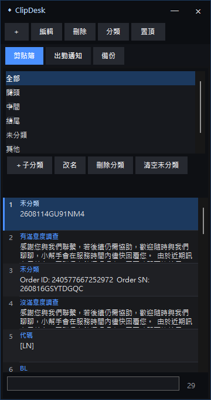

# ClipDesk

ClipDesk 是一款開源、輕量、以本機資料為主的 Windows 剪貼簿管理工具。介面適合維持小視窗、置頂使用，也包含上下班與休息通知功能。



## 功能

- 自動記錄新複製的文字，未整理內容放入「未分類」
- 預設大分類：開頭、中間、結尾、未分類、其他；除未分類外皆可新增、改名或刪除
- 支援不限層數子分類，預設收合並可逐層展開
- 大分類及各層子分類皆可上移／下移，自訂順序會永久保存
- 編輯內容時，同一母分類的所有下層分類會連續排列
- 剪貼簿清單顯示完整分類路徑，包含所有上級分類
- 搜尋、釘選、編輯、另存一份、刪除與右鍵操作
- 雙擊內容可切回上一個視窗並自動貼上
- 滑鼠停留在被截斷的內容或分類時顯示完整文字
- 藍黑無邊框介面、深色捲軸與自繪分類展開按鈕
- 視窗置頂與小型視窗模式
- 上下班與休息通知，日期自動使用今天日期
- JSON 備份匯出與匯入，包含剪貼簿、分類、排序及出勤設定
- 啟動時背景檢查 GitHub Releases，有新版時顯示 Windows 通知與下載按鈕

## 下載

請到 GitHub Releases 下載：

- `ClipDesk-Portable-1.2.0-x64.zip`：免安裝版
- `ClipDesk-Setup-1.2.0-x64.exe`：安裝版

支援 64 位元 Windows。若目標程式以系統管理員身分執行，ClipDesk 也必須以系統管理員身分執行，才能自動貼上。

## 原始碼結構

```text
native/ClipDesk.cs          Windows 原生 WinForms 程式
installer/ClipDesk.nsi      NSIS 安裝腳本
build-native.ps1            一鍵建置腳本
.github/workflows/          GitHub Actions 自動建置
```

目前公開版以單一 C# 原始碼檔為主，方便閱讀、修改與重新編譯。紫色主題可透過編譯常數 `PURPLE_THEME` 啟用；公開藍黑版使用 `PUBLIC_RELEASE,CUSTOM_CHROME`。

## 自行編譯

需求：

- 64 位元 Windows
- Windows 內建的 .NET Framework 4.x C# 編譯器
- 選用：[NSIS](https://nsis.sourceforge.io/)（建立安裝版時需要）

在 PowerShell 執行：

```powershell
.\build-native.ps1
```

建置結果會放在 `dist`：

```text
ClipDesk-Portable-1.2.0-x64.exe
ClipDesk-Setup-1.2.0-x64.exe
```

如果沒有安裝 NSIS，腳本仍會成功建立免安裝版，並略過安裝版。

## 個人資料

發布檔與原始碼不含任何使用者的剪貼簿內容。每位使用者的資料只儲存在：

```text
%LocalAppData%\ClipDesk\data.json
```

解除安裝不會自動刪除這份資料。備份或搬移資料時，建議使用程式內的「備份 → 匯出備份」。

## 參與開發

歡迎 Fork、修改與提出 Pull Request。請先閱讀 [CONTRIBUTING.md](CONTRIBUTING.md)。

## 授權

本專案採用 [MIT License](LICENSE)。
