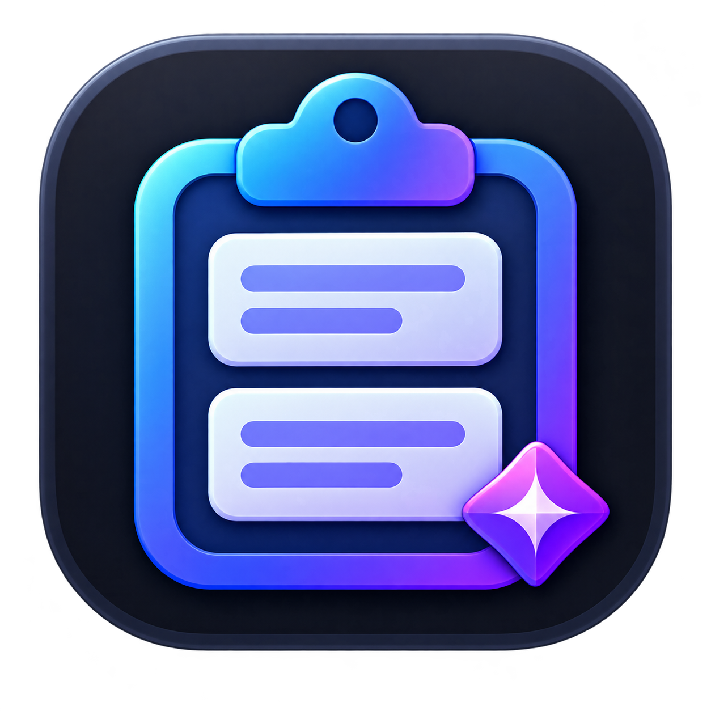

# ClipDesk

<p align="center"></p>

ClipDesk 是一款開源、輕量、資料保存在本機的 Windows 剪貼簿管理工具。它適合維持小視窗、置頂使用，能自動收集複製的文字、建立不限層數的分類，也包含上下班與休息通知文字產生器。


## 主要功能

- 自動記錄新複製的文字，尚未整理的內容放入「未分類」
- 支援大分類與不限層數子分類，可新增、改名、刪除及排序
- 清單顯示包含所有上級分類的完整路徑
- 搜尋、釘選、編輯、另存一份、刪除及右鍵操作
- 雙擊內容可切回上一個視窗並自動貼上
- 滑鼠停留在被截斷的內容或分類時顯示完整文字
- 視窗置頂與小型視窗模式
- 上下班、休息開始與休息結束通知文字
- JSON 備份匯出與匯入
- 背景檢查 GitHub Releases，有新版時顯示 Windows 通知

## 下載與安裝

請到 [GitHub Releases](https://github.com/lunalinly/ClipDesk/releases/latest) 下載最新版本。ClipDesk 支援 64 位元 Windows。

| 版本 | 檔案 | 使用方式 |
| --- | --- | --- |
| 完整版・免安裝 | `ClipDesk-Portable-1.3.0-x64.zip` | 剪貼簿＋出勤通知；解壓縮後執行 `ClipDesk.exe` |
| 完整版・安裝 | `ClipDesk-Setup-1.3.0-x64.exe` | 剪貼簿＋出勤通知；執行安裝程式 |
| 純剪貼簿版・免安裝 | `ClipDesk-Clipboard-Portable-1.3.0-x64.zip` | 只有剪貼簿；解壓縮後執行 `ClipDesk-Clipboard.exe` |
| 純剪貼簿版・安裝 | `ClipDesk-Clipboard-Setup-1.3.0-x64.exe` | 只有剪貼簿；可與完整版並存安裝 |

請勿直接在 ZIP 壓縮檔內執行免安裝版，應先解壓縮到一般資料夾。如果 Windows 顯示安全性提醒，請先確認檔案確實下載自本專案的 Releases 頁面，再決定是否執行。

安裝版與免安裝版使用相同的本機資料位置，因此兩者可以讀取同一份 ClipDesk 資料。

## 快速開始

1. 啟動 ClipDesk。
2. 到其他程式複製一段文字。
3. 新文字會自動出現在 ClipDesk 的「未分類」。
4. 選取該內容並按「編輯」，可修改標題、內容與分類。
5. 回到要輸入文字的程式，再開啟 ClipDesk 並雙擊內容，即可切回上一個視窗自動貼上。
6. 常用內容可以釘選，讓它固定顯示在清單前面。

ClipDesk 只會自動收集純文字。再次複製完全相同的文字時，不會建立重複項目，而是更新原項目的時間並移到較前面。

## 介面說明

### 上方工具列

| 按鈕 | 功能 |
| --- | --- |
| `＋` | 手動新增一筆剪貼簿內容 |
| `編輯` | 編輯目前選取的內容 |
| `刪除` | 刪除目前選取的內容 |
| `分類` | 顯示或隱藏分類管理區 |
| `置頂／已置頂` | 切換視窗是否固定在其他視窗上方 |

### 功能分頁

純剪貼簿版不會顯示「出勤通知」分頁，其餘剪貼簿、分類、備份與更新功能和完整版相同。

- `剪貼簿`：查看、搜尋及使用已保存的文字。
- `出勤通知`：產生上班、休息與下班通知文字（僅完整版）。
- `備份`：匯出備份、匯入備份及手動檢查更新。

## 剪貼簿內容操作

### 複製與自動貼上

- 單擊內容：選取該項目。
- 雙擊內容：複製文字、切回上一個視窗並送出貼上指令。
- 鍵盤 `Enter`：只複製選取內容。
- 鍵盤 `Delete`：刪除選取內容。

在項目上按滑鼠右鍵，可使用：

- `複製`
- `貼上到上一個視窗`
- `編輯`
- `釘選／取消釘選`
- `刪除`

如果找不到上一個視窗，或目標程式拒絕自動輸入，ClipDesk 仍會先把內容複製到系統剪貼簿，之後可以自行按 `Ctrl+V`。

若目標程式以系統管理員身分執行，ClipDesk 也必須以系統管理員身分執行，Windows 才允許自動貼上。

### 新增與編輯

1. 按上方 `＋` 可手動新增內容；選取既有項目後按 `編輯` 可修改內容。
2. 最上方欄位是標題；留空時會自動使用內容第一行。
3. 分類選單依母分類分組，同一母分類的所有下層分類會排在一起。
4. 內容欄可輸入多行文字。
5. 按 `儲存` 會更新原項目。
6. 編輯既有項目時按 `另存一份`，會保留原項目並新增一份副本。

### 搜尋與釘選

底部搜尋框會同時搜尋標題、內容及完整分類路徑。搜尋框右側數字是目前篩選後的項目數量。

釘選項目會顯示 `◆`，並排在未釘選項目前面；同一群組內較新的內容會排在前面。

### 完整文字與分類路徑

清單會顯示完整分類路徑，例如：

```text
開頭 › 客戶 › 售後 › 退款
```

當小視窗寬度不足時，畫面會以省略符號截斷。將滑鼠停在該項目上，即可在提示框查看完整分類與完整文字。

## 分類管理

按上方 `分類` 開啟分類管理區。`全部` 是查看所有內容的虛擬項目，不是真正的分類。

首次使用時會提供以下大分類：

- 開頭
- 中間
- 結尾
- 未分類
- 其他

除了「未分類」以外，大分類與子分類都可以重新命名或刪除。「未分類」是系統必要分類，可以排序，但不能刪除、改名或建立子分類。

### 新增大分類

1. 選取 `全部`。
2. 按 `＋分類`，或按右鍵選擇 `新增分類`。
3. 輸入新的大分類名稱並確認。

### 新增子分類

1. 選取要作為母分類的項目。
2. 按 `＋分類`，或按右鍵選擇 `新增分類`。
3. 輸入子分類名稱並確認。

子分類沒有層數限制。母分類預設收合，點擊母分類左側的 `＋` 可逐層展開；點擊 `－` 可收合。

### 調整分類順序

選取分類後，可使用分類區下方的 `↑`、`↓`，或右鍵選擇 `上移`、`下移`。

- 大分類會在大分類之間移動。
- 子分類只會在相同母分類的同層項目之間移動。
- 自訂順序會立即保存，重新啟動及匯出備份後仍會保留。

### 刪除分類時的處理方式

- 刪除大分類：該分類與所有下層分類會移除，其中的剪貼簿內容會移到「未分類」。
- 刪除子分類：該分類與所有下層分類會移除，其中的剪貼簿內容會移到上一層母分類。
- `清空未分類`：只刪除目前位於「未分類」的剪貼簿內容，不影響其他分類。

刪除分類前會顯示確認視窗，並告知內容將移到哪個分類。

## 出勤通知（僅完整版）

切換到 `出勤通知` 分頁後，可設定：

- 顯示名稱
- 上班時間
- 休息開始
- 休息結束
- 下班時間

日期會自動使用電腦今天的日期，時間可自行輸入，例如 `13:30`。設定會自動保存在本機。

快速複製按鈕包含：

- `上班通知`
- `休息開始`
- `休息結束`
- `下班通知`
- `複製全部`

產生的內容格式如下：

```text
08/20 Luna Lin 10:00 打卡上班
08/20 Luna Lin 13:00 休息開始
08/20 Luna Lin 14:00 休息結束
08/20 Luna Lin 19:00 打卡下班
```

實際日期會依使用當天自動變更。

## 備份與還原

### 匯出備份

選擇 `備份 → 匯出備份`，可將下列資料保存成 JSON：

- 所有剪貼簿內容
- 標題、釘選狀態及分類
- 大分類、子分類與自訂排序
- 出勤名稱與時間設定

### 匯入備份

選擇 `備份 → 匯入備份` 並選取先前匯出的 JSON。匯入會取代目前的剪貼簿內容、分類、排序及出勤設定，建議匯入前先匯出目前資料。

## 更新通知

公開版會在啟動後背景檢查 GitHub Releases，程式持續執行時每 6 小時再檢查一次。

- 有新版時會顯示 Windows 通知及新版下載按鈕。
- 可選擇 `備份 → 檢查更新` 手動檢查。
- 更新只會開啟 Releases 下載頁面，不會強制下載或自動安裝。
- 更新程式不會清除原有本機資料。

## 資料保存與隱私

ClipDesk 不需要帳號或雲端伺服器。發布檔與原始碼不包含任何使用者的剪貼簿資料，資料保存在：

```text
%LocalAppData%\ClipDesk\data.json
```

解除安裝不會自動刪除這份資料。若要搬到另一台電腦，建議使用程式內的 JSON 備份功能。

剪貼簿可能包含密碼、驗證碼或個人資料；請定期檢查並刪除不應長期保存的內容。

## 常見問題

### 雙擊後沒有自動貼上

1. 確認貼上前曾經切換到目標視窗，讓 ClipDesk 能記住上一個視窗。
2. 如果目標程式以系統管理員身分執行，請同樣以系統管理員身分執行 ClipDesk。
3. 部分程式會阻擋模擬鍵盤輸入；此時內容仍已複製，可手動按 `Ctrl+V`。

### 免安裝版無法開啟

1. 確認 ZIP 已完整解壓縮，不要直接從壓縮檔內執行。
2. 確認使用的是 64 位元 Windows。
3. 重新從本專案的 [Releases](https://github.com/lunalinly/ClipDesk/releases/latest) 下載。
4. 若 Windows 封鎖檔案，可在檔案內容中查看是否有「解除封鎖」選項；只應解除封鎖從本專案下載的檔案。

### 分類刪除後內容不見了

內容不會跟著分類一起刪除。刪除大分類後請到「未分類」查看；刪除子分類後請到上一層母分類查看。

### 換成新版會不會清除資料

不會。資料與程式檔分開保存在 `%LocalAppData%\ClipDesk\data.json`。重要資料仍建議先匯出備份。

## 原始碼結構

```text
native/ClipDesk.cs          Windows 原生 WinForms 程式
assets/clipdesk.ico         Windows 多尺寸應用程式圖示
assets/clipdesk-icon.png    圖示高解析度來源圖
installer/ClipDesk.nsi      完整版 NSIS 安裝腳本
installer/ClipDesk.Clipboard.nsi  純剪貼簿版 NSIS 安裝腳本
build-native.ps1            一鍵建置腳本
sign-windows.ps1            Authenticode 自動簽章與驗證腳本
.github/workflows/          GitHub Actions 自動建置
```

公開版以單一 C# 原始碼檔為主，方便閱讀、修改與重新編譯。公開藍黑版使用編譯常數 `PUBLIC_RELEASE,CUSTOM_CHROME`；紫色主題可透過 `PURPLE_THEME` 啟用。

## 自行編譯

需求：

- 64 位元 Windows
- Windows 內建的 .NET Framework 4.x C# 編譯器
- 選用：[NSIS](https://nsis.sourceforge.io/)（建立安裝版時需要）

在 PowerShell 執行：

```powershell
.\build-native.ps1
```

建置結果會放在 `dist`：

```text
ClipDesk-Portable-1.3.0-x64.exe
ClipDesk-Setup-1.3.0-x64.exe
ClipDesk-Clipboard-Portable-1.3.0-x64.exe
ClipDesk-Clipboard-Setup-1.3.0-x64.exe
```

如果沒有安裝 NSIS，腳本仍會建立免安裝版，並略過安裝版。
## 自動程式碼簽章

`build-native.ps1` 會在建立安裝程式前簽署免安裝 EXE，完成安裝程式後再簽署 Setup EXE。沒有設定憑證時會略過簽章；使用 `-RequireSigning` 可要求缺少憑證時直接停止建置。

本機可使用憑證存放區中的核准憑證：

```powershell
$env:CLIPDESK_SIGNING_CERT_THUMBPRINT = "憑證指紋"
$env:CLIPDESK_SIGNING_CERT_STORE = "CurrentUser"
.\build-native.ps1 -RequireSigning
```

GitHub Actions 請在 Repository settings → Secrets and variables → Actions 新增：

- `CLIPDESK_SIGNING_CERT_BASE64`：PFX 檔案的 Base64 內容
- `CLIPDESK_SIGNING_CERT_PASSWORD`：PFX 密碼
- 選用變數 `CLIPDESK_TIMESTAMP_URL`：RFC 3161 時間戳服務；未設定時使用 DigiCert

憑證與密碼不可提交到 Git。Fork 或沒有 Secrets 的建置會保留原本的未簽章行為；設定 Secrets 後，四個公開版產出會自動簽章並驗證。

## 參與開發

歡迎 Fork、修改與提出 Pull Request。請先閱讀 [CONTRIBUTING.md](CONTRIBUTING.md)。

## 授權

本專案採用 [MIT License](LICENSE)。
